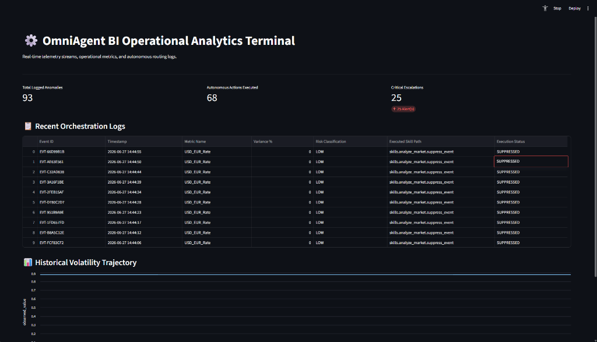
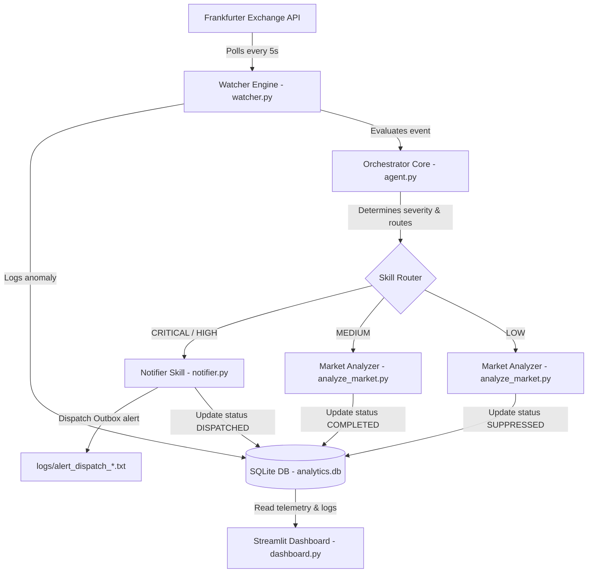

# ⚙️ OmniAgent BI: Operational Analytics Terminal

A real-time telemetry monitoring, automated event routing, and autonomous operational decision-ledger terminal. This project showcases a local event loop that polls currency volatility metrics, processes them through a deterministic orchestrator, executes targeted functional skills based on severity levels, and presents findings in a Streamlit analytics dashboard.

---

## 🖥️ Operational Dashboard



---

## 🚀 Key Features

*   **Real-Time Data Ingestion:** Asynchronously fetches USD/EUR exchange rates from the public Frankfurter API every 5 seconds using `aiohttp`.
*   **Deterministic Evaluation Core:** Evaluates computed percentage variances against production-grade thresholds to assign a risk severity (CRITICAL, HIGH, MEDIUM, LOW) without dependency on high-latency cloud models.
*   **Autonomous Functional Skill Routing:** Automatically executes targeted actions:
    *   *High-severity breaches* generate outbox email/SMS templates written directly to disk log files.
    *   *Mid-severity events* process and archive metrics.
    *   *Low-severity fluctuations* are classified as suppressed telemetry noise.
*   **Relational Database Ledger:** Persists all raw telemetry data (`data_events`) and audit trails of autonomous agent decisions (`agent_actions`) within a local SQLite database.
*   **Operational Dashboard:** Real-time visual terminal powered by Streamlit, complete with real-time KPI metrics, tabular logs, and line-chart volatility visualization.

---

## 📊 System Architecture



---

## 📂 Project Structure

Below is the layout of the project, including links to primary files:

*   📂 **`data/`**
    *   📄 [analytics.db](file:///c:/Users/gitongaR01/OneDrive%20-%20gab.co.ke/Data%20&%20Analytics/Data%20&%20IT%20Dev/Repos/Personal/github/Omniagent%20bi/data/analytics.db): SQLite relational ledger storing telemetry logs and agent audit actions.
*   📂 **`src/`**
    *   📄 [database.py](file:///c:/Users/gitongaR01/OneDrive%20-%20gab.co.ke/Data%20&%20Analytics/Data%20&%20IT%20Dev/Repos/Personal/github/Omniagent%20bi/src/database.py): Core database connection and table initialization scripts.
    *   📄 [watcher.py](file:///c:/Users/gitongaR01/OneDrive%20-%20gab.co.ke/Data%20&%20Analytics/Data%20&%20IT%20Dev/Repos/Personal/github/Omniagent%20bi/src/watcher.py): Asynchronous event listener polling exchange rate telemetry.
    *   📄 [agent.py](file:///c:/Users/gitongaR01/OneDrive%20-%20gab.co.ke/Data%20&%20Analytics/Data%20&%20IT%20Dev/Repos/Personal/github/Omniagent%20bi/src/agent.py): Rule-based orchestrator evaluating events and executing dynamic skills.
    *   📄 [dashboard.py](file:///c:/Users/gitongaR01/OneDrive%20-%20gab.co.ke/Data%20&%20Analytics/Data%20&%20IT%20Dev/Repos/Personal/github/Omniagent%20bi/src/dashboard.py): Interactive Streamlit-powered BI metrics and charts UI.
    *   📂 **`skills/`**
        *   📄 [analyze_market.py](file:///c:/Users/gitongaR01/OneDrive%20-%20gab.co.ke/Data%20&%20Analytics/Data%20&%20IT%20Dev/Repos/Personal/github/Omniagent%20bi/src/skills/analyze_market.py): Functional skills handling low and moderate variance events.
        *   📄 [notifier.py](file:///c:/Users/gitongaR01/OneDrive%20-%20gab.co.ke/Data%20&%20Analytics/Data%20&%20IT%20Dev/Repos/Personal/github/Omniagent%20bi/src/skills/notifier.py): Emergency operational dispatch alerts skill.
*   📄 [requirements.txt](file:///c:/Users/gitongaR01/OneDrive%20-%20gab.co.ke/Data%20&%20Analytics/Data%20&%20IT%20Dev/Repos/Personal/github/Omniagent%20bi/requirements.txt): External Python package requirements list.

---

## ⚙️ Setup and Installation

### 1. Prerequisites
Ensure you have Python 3.8+ installed on your computer.

### 2. Install Dependencies
Navigate to the project root and install the required external libraries using `pip`:

```bash
pip install -r requirements.txt
```

### 3. Initialize the Relational Ledger
Generate the local SQLite database and construct the schemas (`data_events` & `agent_actions`):

```bash
python src/database.py
```

---

## 🏃 Run the System

The pipeline operates in two parallel processes: a data ingestion script (Watcher) and a user visualization front-end (Dashboard).

### Phase 1: Ingestion & Routing (Watcher Loop)
Launch the watcher engine to poll live Frankfurter APIs, calculate volatility variance, and trigger orchestrator routing decisions:

```bash
python src/watcher.py
```

### Phase 2: Analytics Visualization (Streamlit Dashboard)
Run the user-facing operational terminal:

```bash
streamlit run src/dashboard.py
```
This command opens a local host window in your default browser dashboard showcasing telemetry metrics, logs, and a line chart updated dynamically.

---

## 📋 Rule Engine Routing Matrix

The orchestrator classifies events according to the following guidelines:

| Computed Variance | Severity Class | Routed Skill | Expected Action / Output |
| :--- | :--- | :--- | :--- |
| **$\ge$ 5.0%** | `CRITICAL` | `skills.notifier.send_alert` | Writes emergency file alert payload to `logs/alert_dispatch_*.txt` & marks as `DISPATCHED` |
| **$\ge$ 2.0%** | `HIGH` | `skills.notifier.send_alert` | Writes emergency file alert payload to `logs/alert_dispatch_*.txt` & marks as `DISPATCHED` |
| **$\ge$ 0.5%** | `MEDIUM` | `skills.analyze_market.log_variance` | Archives telemetry metrics & updates status to `COMPLETED` |
| **< 0.5%** | `LOW` | `skills.analyze_market.suppress_event` | Suppresses telemetry noise & updates status to `SUPPRESSED` |
